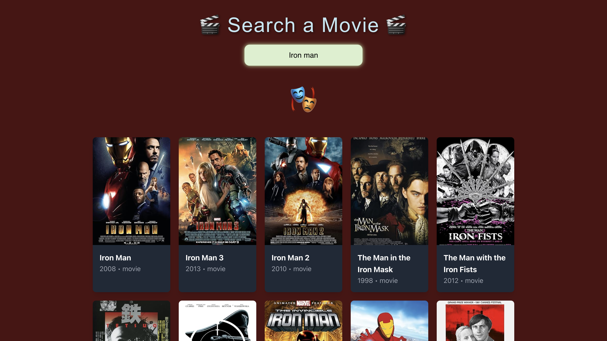

<h1 align="center">🎬 Search Movie</h1>

<p align="center">
  <em>A simple and modern movie search web app built with <b>React</b>, <b>Vite</b>, and <b>TailwindCSS</b>.</em><br>
  Search your favorite movies instantly, explore details, and enjoy a clean, responsive design.
</p>

---

## 🚀 Overview

**Search Movie** allows users to search movies online in real time.  
It’s a lightweight and responsive app that fetches movie data from an API and displays it in visually appealing cards.

> 💡 Built to explore **React hooks**, **component-based design**, and **API integration** using modern front-end tooling.

---

## ✨ Features

- 🔎 Real-time movie search  
- 🧩 Modular React components (MovieCard, SearchBar, Loader, etc.)  
- 📱 Responsive layout using TailwindCSS  
- ⚡ Fast performance with Vite  
- ❗ Error and loading states handled gracefully  

---

## 🧠 Tech Stack

| Technology | Purpose |
|-------------|----------|
| **React** | UI framework for building components |
| **Vite** | Development and build tool |
| **TailwindCSS** | Utility-first CSS styling |
| **JavaScript (ES6+)** | Core programming language |
| **API Integration** | Fetch movie data dynamically |

---

## 🖼️ Screenshots

| Main Page | Results Page |
|------------|--------------|
|  |  |

> 🖥️ The main page shows trending or recent movies.  
> 🎞️ The results page displays search results dynamically as you type.

---

## ⚙️ Installation & Setup

1. **Clone the repository**
   ```bash
  git clone https://github.com/Gozde03/search-movie.git
cd search-movie
npm install
npm run dev

Open in browser: http://localhost:5173


   
---

   ## 👩‍💻 Author

**Developed by:** [ Gözde Şavkın ](https://github.com/Gozde03) 

 *Built as a front-end learning project focused on movie API integration, responsive UI, and clean component design.*

---
```
